# Local Test Instructions and Evidence Guide

## Raft KV Store — 16 Functional Tests

---

## Prerequisites

Make sure you have the binary built and no stale data:

```bash
cd raft-kv
go build -o raft-kv .
rm -rf /tmp/raft-kv
```

Install Python dependencies for the correctness checker:

```bash
python3 -m venv venv
source venv/bin/activate
pip install requests
```

---

## Step 1 — Start the 3-Node Cluster

Open **4 terminal windows** side by side before starting. This layout makes it easy to screenshot all terminals together.

**Terminal 1 — node1 (bootstrap leader)**

```bash
NODE_ID=node1 RAFT_ADDR=127.0.0.1:7001 HTTP_ADDR=:17001 \
DATA_DIR=/tmp/raft-kv/node1 BOOTSTRAP=true ./raft-kv
```

Wait until you see:

```
entering leader state: leader="Node at 127.0.0.1:7001 [Leader]"
HTTP server listening on :17001
```

**Terminal 2 — node2**

```bash
NODE_ID=node2 RAFT_ADDR=127.0.0.1:7002 HTTP_ADDR=:17002 \
DATA_DIR=/tmp/raft-kv/node2 JOIN_ADDR=localhost:17001 ./raft-kv
```

**Terminal 3 — node3**

```bash
NODE_ID=node3 RAFT_ADDR=127.0.0.1:7003 HTTP_ADDR=:17003 \
DATA_DIR=/tmp/raft-kv/node3 JOIN_ADDR=localhost:17001 ./raft-kv
```

**Terminal 4 — curl commands (run all tests here)**

📸 **Screenshot 1:** All 4 terminals visible with cluster running. Capture the `entering leader state` log in Terminal 1 and `HTTP server listening` in all three nodes.
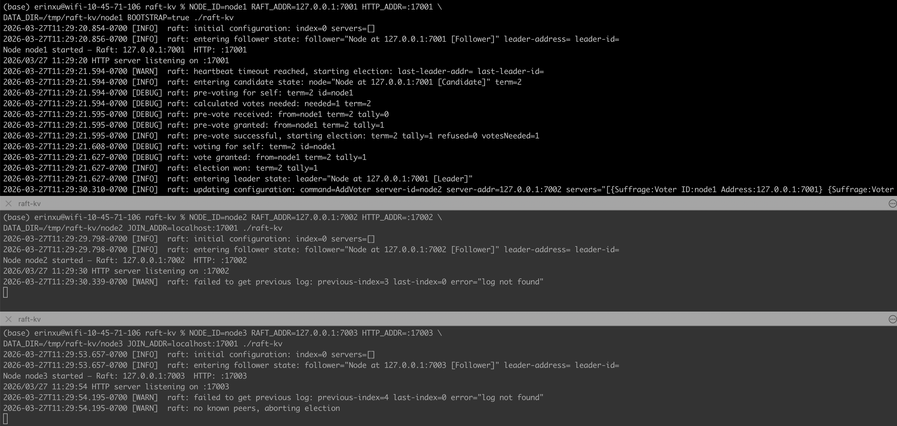

---

## Step 2 — Functional Tests

### Test 1: Write to Leader

```bash
curl -X PUT http://localhost:17001/key/hello -d "world"
```

Expected: empty response, exit code 0 (204 No Content)

### Test 2: Read — Strong / Default / Stale

```bash
curl "http://localhost:17001/key/hello?level=strong"
curl "http://localhost:17002/key/hello?level=default"
curl "http://localhost:17003/key/hello?level=stale"
```

Expected: all three return `{"key":"hello","value":"world"}`

📸 **Screenshot 2:** Terminal 4 showing all three reads returning the correct value.
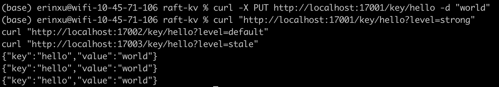

### Test 3: Delete + 404 Verification

```bash
curl -X DELETE http://localhost:17001/key/hello
curl "http://localhost:17001/key/hello?level=strong"
```

Expected: DELETE returns 204, GET returns `key not found`

### Test 4: Transparent Write Forwarding from Follower

```bash
curl -X PUT http://localhost:17002/key/forwarded -d "from-follower"
curl "http://localhost:17001/key/forwarded?level=strong"
curl "http://localhost:17003/key/forwarded?level=stale"
```

Expected: write to node2 (follower) succeeds silently, readable from all nodes

📸 **Screenshot 3:** Terminal 4 showing write to follower (:17002) succeeds, and both reads return `from-follower`.
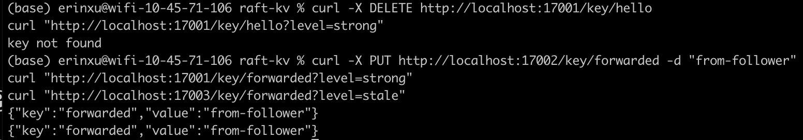

### Test 5: Health Endpoint

```bash
curl http://localhost:17001/health
curl http://localhost:17002/health
curl http://localhost:17003/health
```

Expected:

```json
{"leader":"127.0.0.1:7001","role":"leader"}
{"leader":"127.0.0.1:7001","role":"follower"}
{"leader":"127.0.0.1:7001","role":"follower"}
```

📸 **Screenshot 4:** All three health responses showing correct roles and leader address.
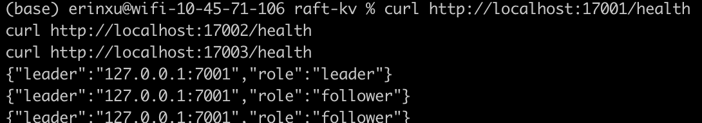

---

## Step 3 — Consistency Mode Tests

### Test 6: All 3 Levels Return Same Value

```bash
curl -X PUT http://localhost:17001/key/consistency -d "test"
curl "http://localhost:17001/key/consistency?level=strong"
curl "http://localhost:17002/key/consistency?level=default"
curl "http://localhost:17003/key/consistency?level=stale"
```

Expected: all three return `{"key":"consistency","value":"test"}`

### Test 7: Strong Read on Follower Forwarded to Leader

```bash
curl "http://localhost:17002/key/consistency?level=strong"
curl "http://localhost:17003/key/consistency?level=strong"
```

Expected: both return `{"key":"consistency","value":"test"}` — not an error

📸 **Screenshot 5:** Strong reads on both followers returning the correct value (not a redirect or error).
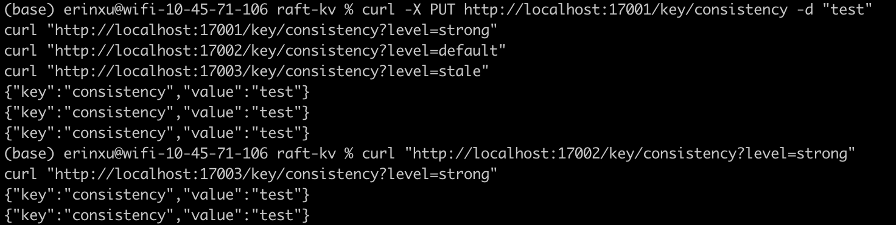

### Test 8: Nonexistent Key 404 on All Levels

```bash
curl "http://localhost:17001/key/doesnotexist?level=strong"
curl "http://localhost:17002/key/doesnotexist?level=stale"
curl "http://localhost:17003/key/doesnotexist?level=default"
```

Expected: all return `key not found`
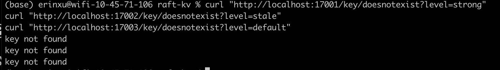

---

## Step 4 — Failover Tests

### Test 9: Leader Killed → New Election Observed

First write a key, then kill the leader:

```bash
curl -X PUT http://localhost:17001/key/before-failover -d "exists"
```

Now go to **Terminal 1** and press `Ctrl+C` to kill node1.

Back in Terminal 4, check health immediately:

```bash
curl http://localhost:17002/health
curl http://localhost:17003/health
```

Expected: one of node2 or node3 shows `"role":"leader"`

📸 **Screenshot 6:** Terminal 1 showing node1 killed (process stopped), AND Terminal 4 showing new leader elected (node2 or node3 showing `"role":"leader"`). Capture both in the same screenshot if possible.
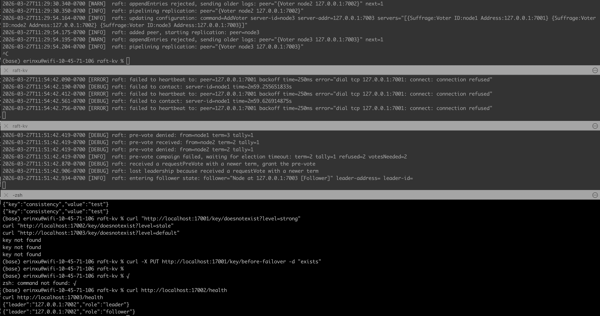

### Test 10: Writes Continue After Failover

```bash
curl -X PUT http://localhost:17002/key/after-failover -d "survived"
curl -X PUT http://localhost:17003/key/after-failover -d "survived"
```

Expected: one succeeds (whichever node is the new leader, the other forwards)

```bash
curl "http://localhost:17002/key/after-failover?level=stale"
curl "http://localhost:17003/key/after-failover?level=stale"
```

Expected: both return `{"key":"after-failover","value":"survived"}`

📸 **Screenshot 7:** Writes and reads succeeding on the surviving nodes after leader kill.
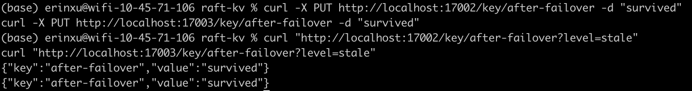

### Test 11: Pre-Failover Data Survives

```bash
curl "http://localhost:17002/key/before-failover?level=stale"
```

Expected: `{"key":"before-failover","value":"exists"}` — data written before the kill is preserved
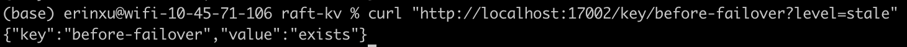

### Test 12: Node Restart + Rejoin as Follower

Restart node1 in Terminal 1 (without deleting data):

```bash
NODE_ID=node1 RAFT_ADDR=127.0.0.1:7001 HTTP_ADDR=:17001 \
DATA_DIR=/tmp/raft-kv/node1 BOOTSTRAP=true ./raft-kv
```

Wait for it to start, then check health:

```bash
curl http://localhost:17001/health
```

Expected: `"role":"follower"` — node1 rejoins as follower, does NOT reclaim leadership

Write to restarted node1:

```bash
curl -X PUT http://localhost:17001/key/after-restart -d "node1-rejoined"
curl "http://localhost:17002/key/after-restart?level=stale"
```

Expected: write forwarded to current leader, readable from node2

📸 **Screenshot 8:** node1 health showing `"role":"follower"` after restart, and the write to node1 being readable from node2.
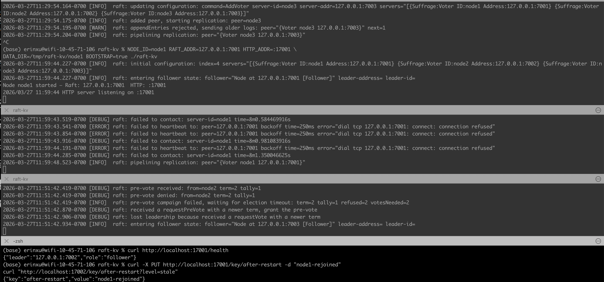

---

## Step 5 — Correctness Checker Tests

Make sure the venv is active:

```bash
source venv/bin/activate
```

### Test 13: Zero Divergence — Healthy Cluster

```bash
python3 correctness_check.py
```

Expected:

```
👑  localhost:17002  →  leader   (or whichever node is currently leader)
✅  localhost:17001  →  follower
✅  localhost:17003  →  follower
Keys checked: 5 | Diverged: 0
✅ ALL NODES CONSISTENT — Raft safety property holds
```

📸 **Screenshot 9:** Full correctness checker output showing zero divergence on healthy cluster.
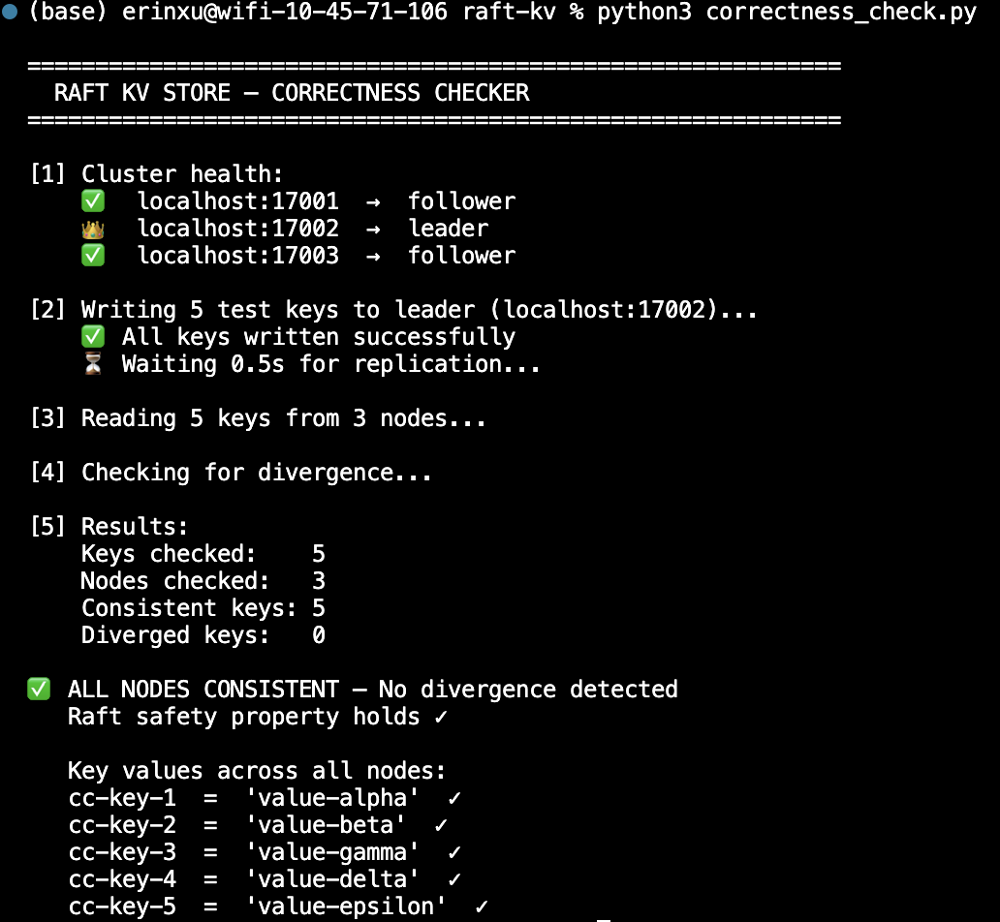

### Test 14: Zero Divergence — After Leader Kill

Kill the current leader (whichever node shows `"role":"leader"` in health), then run:

```bash
python3 correctness_check.py --wait 2.0
```

Expected:

```
❌  localhost:17002  →  unreachable   (killed node)
👑  localhost:17003  →  leader        (new leader)
✅  localhost:17001  →  follower
Keys checked: 5 | Diverged: 0
✅ ALL NODES CONSISTENT — Raft safety property holds
```

📸 **Screenshot 10:** Correctness checker output after leader kill — showing one node unreachable, new leader elected, and zero divergence.
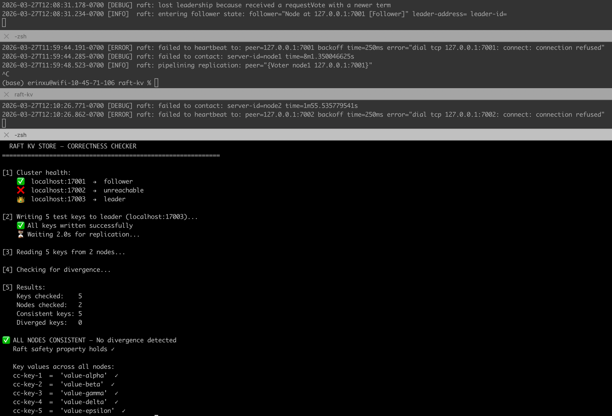

---

## Step 6 — Persistence Test

### Test 15: BoltDB Log Replayed on Restart

Write a key, then kill ALL nodes, restart WITHOUT deleting data:

```bash
# Write key
curl -X PUT http://localhost:17001/key/persist-test -d "survives-restart"

# Kill all nodes — Ctrl+C in Terminal 1, 2, 3

# Restart all three (do NOT run rm -rf /tmp/raft-kv)
# Terminal 1:
NODE_ID=node1 RAFT_ADDR=127.0.0.1:7001 HTTP_ADDR=:17001 \
DATA_DIR=/tmp/raft-kv/node1 BOOTSTRAP=true ./raft-kv

# Terminal 2:
NODE_ID=node2 RAFT_ADDR=127.0.0.1:7002 HTTP_ADDR=:17002 \
DATA_DIR=/tmp/raft-kv/node2 JOIN_ADDR=localhost:17001 ./raft-kv

# Terminal 3:
NODE_ID=node3 RAFT_ADDR=127.0.0.1:7003 HTTP_ADDR=:17003 \
DATA_DIR=/tmp/raft-kv/node3 JOIN_ADDR=localhost:17001 ./raft-kv

# Read the key back
curl "http://localhost:17001/key/persist-test?level=strong"
```

Expected: `{"key":"persist-test","value":"survives-restart"}` — BoltDB replayed the log on restart

📸 **Screenshot 11:** The key readable after full cluster restart, proving BoltDB persistence.
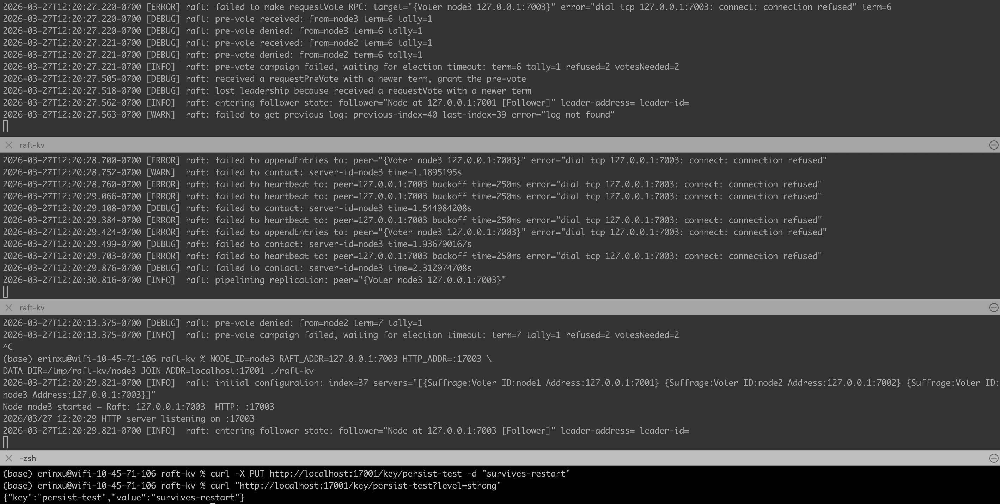

---

## Test Results Summary

| Category    | Test                                       | Expected                     | Result |
| ----------- | ------------------------------------------ | ---------------------------- | ------ |
| Functional  | Write to leader                            | 204 No Content               | ✅     |
| Functional  | Read — strong / default / stale            | Same value on all 3          | ✅     |
| Functional  | Delete + 404 verification                  | 404 after delete             | ✅     |
| Functional  | Transparent write forwarding from follower | 204, no redirect             | ✅     |
| Functional  | Health endpoint                            | Correct roles                | ✅     |
| Consistency | All 3 levels return same value             | Identical values             | ✅     |
| Consistency | Strong read on follower forwarded          | Value returned, not error    | ✅     |
| Consistency | Nonexistent key 404 on all levels          | 404 on all                   | ✅     |
| Failover    | Leader killed → new election               | New leader elected           | ✅     |
| Failover    | Writes continue after failover             | 204 on surviving nodes       | ✅     |
| Failover    | Pre-failover data survives                 | Value still readable         | ✅     |
| Failover    | Node restart + rejoin as follower          | role: follower               | ✅     |
| Correctness | Zero divergence — healthy cluster          | 5/5 keys consistent          | ✅     |
| Correctness | Zero divergence — after leader kill        | 5/5 keys consistent          | ✅     |
| Persistence | BoltDB log replayed on restart             | Value readable after restart | ✅     |
